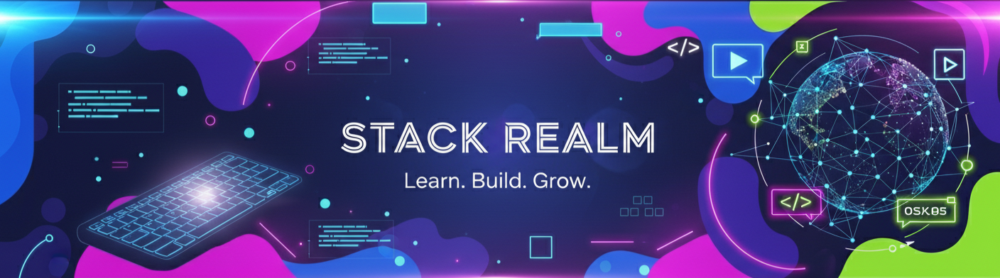

# Requirements Document - Learning Hub

  

<h1 align="center">📋 Technical & Functional Requirements</h1>

  Comprehensive requirements specification for the Learning Hub platform 
  <em>A community-driven "Learn by Build" platform for students, developers, and creators</em>

---

## 📖 1. Project Overview

### 1.1 Vision Statement
Learning Hub is an open-source initiative that transforms learning through hands-on building experiences. We believe in the philosophy of *learn → build → share → grow*, creating a community-driven platform where learners acquire new skills by constructing real-world projects rather than consuming theoretical content.

### 1.2 Goals and Objectives
- **Primary Goal**: Create a comprehensive "Learn by Build" platform that makes skill acquisition practical and engaging
- **Community Building**: Foster a collaborative environment for learners at all levels
- **Knowledge Democratization**: Provide free, accessible learning resources and project templates
- **Skill Development**: Bridge the gap between theoretical learning and practical application
- **Open Source Contribution**: Enable community-driven content creation and platform enhancement

### 1.3 Target Audience
- **Students**: University and college students seeking practical experience
- **Beginners**: Individuals starting their programming journey
- **Professionals**: Developers looking to expand their skill set
- **Educators**: Instructors seeking project-based learning resources
- **Contributors**: Open-source enthusiasts wanting to share knowledge

### 1.4 Success Criteria
- Active community of 1000+ users within first year
- 50+ structured learning modules across different technology stacks
- 100+ completed community projects
- High user engagement with average session duration > 30 minutes
- Positive feedback score > 4.5/5 from user surveys

---

## 🔧 2. Technical Requirements

### 2.1 System Architecture
- **Architecture Pattern**: Modular, microservices-oriented design
- **Development Approach**: Progressive Web Application (PWA)
- **Responsive Design**: Mobile-first, cross-platform compatibility
- **Performance Target**: < 3 second initial load time, < 1 second navigation

### 2.2 Frontend Technology Stack
- **Core Technologies**: HTML5, CSS3, JavaScript (ES6+)
- **CSS Framework**: Tailwind CSS for utility-first styling
- **JavaScript Framework**: React 18+ with hooks and functional components
- **State Management**: React Context API, Redux Toolkit for complex state
- **Routing**: React Router v6+
- **Build Tools**: Vite or Create React App
- **Package Manager**: npm or yarn

### 2.3 Backend Technology Stack
- **Runtime Environment**: Node.js (LTS version 18+)
- **Web Framework**: Express.js 4.x
- **API Design**: RESTful API with GraphQL consideration for future
- **Authentication**: JWT-based authentication with refresh tokens
- **Session Management**: Redis for session storage
- **File Upload**: Multer for handling file uploads
- **Security**: Helmet.js, CORS, rate limiting

### 2.4 Database Requirements
- **Primary Database**: MongoDB 6.0+ for document storage
- **ODM**: Mongoose for object document mapping
- **Data Structure**: Flexible schema for diverse learning content
- **Indexing**: Optimized indexes for search and retrieval
- **Backup Strategy**: Daily automated backups with point-in-time recovery

### 2.5 Development Tools
- **Version Control**: Git with GitHub workflow
- **Code Editor**: VS Code with recommended extensions
- **Linting**: ESLint with Prettier for code formatting
- **Testing Framework**: Jest for unit testing, Cypress for E2E testing
- **API Testing**: Postman or Insomnia for API development
- **Monitoring**: Application performance monitoring tools

### 2.6 Browser Compatibility
- **Modern Browsers**: Chrome 90+, Firefox 88+, Safari 14+, Edge 90+
- **Mobile Browsers**: iOS Safari 14+, Chrome Mobile 90+
- **Legacy Support**: Graceful degradation for older browsers
- **Accessibility**: WCAG 2.1 AA compliance

---

## ⚙️ 3. Functional Requirements

### 3.1 Core Learning Features

#### 3.1.1 Learning Modules
- **Structured Paths**: Organized learning tracks for different technology stacks
- **Progressive Difficulty**: Beginner to advanced content progression
- **Interactive Content**: Hands-on coding exercises and tutorials
- **Assessment Tools**: Knowledge checks and practical evaluations
- **Completion Tracking**: Progress indicators and achievement badges

#### 3.1.2 Project-Based Learning
- **Mini Projects**: Quick 1-2 hour coding challenges
- **Comprehensive Projects**: Multi-week real-world applications
- **Project Templates**: Starter code and scaffolding for common patterns
- **Code Reviews**: Peer and mentor feedback mechanisms
- **Project Showcase**: Gallery of completed community projects

#### 3.1.3 Technology Stack Coverage
- **Web Development**: HTML/CSS, JavaScript, React, Node.js
- **Data Science**: Python, pandas, scikit-learn, Jupyter notebooks
- **Linux/DevOps**: Command line, scripting, containerization
- **AI/ML**: Machine learning fundamentals, TensorFlow, PyTorch
- **Mobile Development**: React Native, Flutter (future expansion)

### 3.2 Community Features

#### 3.2.1 User Management
- **Registration/Login**: Email-based account creation with email verification
- **User Profiles**: Customizable profiles with learning progress and achievements
- **Role System**: Learners, mentors, contributors, and administrators
- **Social Features**: Following users, activity feeds, and networking

#### 3.2.2 Collaboration Tools
- **Discussion Forums**: Topic-based discussions and Q&A sections
- **Code Sharing**: Integrated code snippets and project sharing
- **Mentorship Program**: Matching system for mentors and learners
- **Study Groups**: Virtual learning circles and collaborative projects

#### 3.2.3 Content Contribution
- **User-Generated Content**: Community-contributed learning modules
- **Content Review System**: Peer review and moderation workflows
- **Version Control**: Track changes and improvements to learning materials
- **Recognition System**: Contributor credits and reputation scoring

### 3.3 Platform Management

#### 3.3.1 Content Management System
- **Admin Dashboard**: Content creation and management interface
- **Media Library**: Storage and organization of images, videos, and documents
- **SEO Optimization**: Meta tags, structured data, and search optimization
- **Analytics Integration**: User behavior tracking and learning analytics

#### 3.3.2 Search and Discovery
- **Full-Text Search**: Comprehensive search across all content types
- **Filter System**: Technology, difficulty level, and content type filters
- **Recommendation Engine**: Personalized learning path suggestions
- **Trending Content**: Popular and highly-rated learning materials

---

## 🚀 4. Non-Functional Requirements

### 4.1 Performance Requirements
- **Page Load Time**: < 3 seconds for initial page load
- **Time to Interactive**: < 5 seconds for full interactivity
- **API Response Time**: < 500ms for 95% of API calls
- **Concurrent Users**: Support 1000+ simultaneous users
- **Database Queries**: < 100ms for 90% of database operations
- **CDN Integration**: Global content delivery for static assets

### 4.2 Security Requirements
- **Data Encryption**: TLS 1.3 for data in transit, AES-256 for data at rest
- **Authentication**: Multi-factor authentication support
- **Authorization**: Role-based access control (RBAC)
- **Input Validation**: Comprehensive server-side validation and sanitization
- **Security Headers**: HTTPS enforcement, HSTS, CSP implementation
- **Vulnerability Management**: Regular security audits and dependency updates

### 4.3 Usability Requirements
- **Accessibility**: WCAG 2.1 AA compliance for users with disabilities
- **Internationalization**: Support for multiple languages (i18n)
- **Mobile Responsiveness**: Optimal experience across all device sizes
- **User Interface**: Intuitive navigation with < 3 clicks to reach any content
- **Loading States**: Clear feedback during data loading and processing
- **Error Handling**: User-friendly error messages and recovery options

### 4.4 Scalability Requirements
- **Horizontal Scaling**: Ability to scale across multiple server instances
- **Database Scaling**: Support for read replicas and sharding
- **Caching Strategy**: Multi-level caching (browser, CDN, application, database)
- **Load Balancing**: Distribution of traffic across multiple servers
- **Auto-scaling**: Automatic resource allocation based on demand
- **Microservices Ready**: Architecture that supports service decomposition

### 4.5 Reliability Requirements
- **Uptime**: 99.9% availability (< 8.77 hours downtime per year)
- **Error Rate**: < 0.1% error rate for critical user journeys
- **Data Backup**: Real-time replication with 4-hour recovery time objective
- **Disaster Recovery**: Complete system recovery within 24 hours
- **Monitoring**: Real-time system health and performance monitoring
- **Graceful Degradation**: Continued functionality during partial system failures

---

## 🛠️ 5. Development Requirements

### 5.1 Version Control and Workflow
- **Git Strategy**: GitFlow branching model with feature branches
- **Code Review**: Mandatory peer review for all code changes
- **Commit Standards**: Conventional commits for clear change history
- **Branch Protection**: Required status checks and review approvals
- **Release Management**: Semantic versioning and automated release notes

### 5.2 Testing Standards
- **Unit Testing**: Minimum 80% code coverage for critical components
- **Integration Testing**: API endpoint testing with automated test suites
- **End-to-End Testing**: User journey testing with Cypress or Playwright
- **Performance Testing**: Load testing for critical user flows
- **Security Testing**: Automated vulnerability scanning and penetration testing
- **Cross-Browser Testing**: Compatibility testing across supported browsers

### 5.3 Code Quality Standards
- **Linting**: ESLint configuration with team-agreed rules
- **Formatting**: Prettier for consistent code formatting
- **Type Safety**: TypeScript adoption for improved code reliability
- **Code Reviews**: Structured review process with checklist
- **Documentation**: Inline code documentation and README files
- **Complexity Metrics**: Monitoring and limiting code complexity

### 5.4 Continuous Integration/Continuous Deployment
- **CI Pipeline**: GitHub Actions for automated testing and builds
- **Automated Testing**: Run all test suites on every pull request
- **Build Automation**: Automated build and artifact generation
- **Deployment Automation**: Automated deployment to staging and production
- **Rollback Strategy**: Quick rollback capability for failed deployments
- **Environment Consistency**: Containerized deployments with Docker

### 5.5 Documentation Requirements
- **API Documentation**: OpenAPI/Swagger specification for all endpoints
- **User Documentation**: Comprehensive guides for end users
- **Developer Documentation**: Setup guides and architecture documentation
- **Code Documentation**: JSDoc for JavaScript functions and components
- **Change Documentation**: Release notes and migration guides
- **Onboarding Documentation**: New contributor and developer guides

---

## 🔗 6. Integration Requirements

### 6.1 Third-Party Services
- **Authentication Providers**: GitHub OAuth, Google OAuth integration
- **Cloud Storage**: AWS S3 or similar for user-generated content
- **Email Service**: SendGrid or similar for transactional emails
- **Analytics**: Google Analytics 4 for user behavior tracking
- **Error Monitoring**: Sentry for error tracking and performance monitoring
- **Payment Processing**: Stripe for future premium features (planned)

### 6.2 External APIs
- **GitHub API**: Repository integration for code project management
- **Code Execution**: Integration with online code execution services
- **Video Hosting**: YouTube or Vimeo for tutorial content
- **Documentation APIs**: Integration with documentation platforms
- **Social Media**: Sharing capabilities with major social platforms

### 6.3 Development Tools Integration
- **Code Quality**: SonarQube or CodeClimate for code quality metrics
- **Dependency Management**: Automated dependency updates with Dependabot
- **Security Scanning**: GitHub Security Advisories and Snyk integration
- **Performance Monitoring**: New Relic or DataDog for application monitoring
- **Log Management**: Centralized logging with ELK stack or similar

### 6.4 Data Integration
- **Import/Export**: Support for common data formats (JSON, CSV, XML)
- **Backup Integration**: Automated backups to cloud storage
- **Migration Tools**: Data migration utilities for version upgrades
- **Sync Capabilities**: Real-time data synchronization across services
- **API Rate Limiting**: Respectful integration with external API limits

---

## 💻 7. Platform Requirements

### 7.1 Web Application Specifications
- **Progressive Web App**: Offline functionality and app-like experience
- **Single Page Application**: React-based SPA with client-side routing
- **Responsive Design**: Mobile-first design with breakpoints for all devices
- **Cross-Platform**: Consistent experience across operating systems
- **Browser Standards**: Modern web standards compliance (ES6+, CSS Grid, Flexbox)

### 7.2 Infrastructure Requirements
- **Cloud Hosting**: AWS, Google Cloud, or Azure for scalable infrastructure
- **Content Delivery Network**: Global CDN for static asset delivery
- **Database Hosting**: Managed MongoDB service (Atlas) or self-hosted cluster
- **Load Balancing**: Application load balancer for high availability
- **SSL/TLS**: Full encryption with automatic certificate management

### 7.3 Development Environment
- **Local Development**: Docker Compose for consistent local environments
- **Staging Environment**: Production-like staging for testing
- **Development Tools**: Integrated development environment setup guides
- **API Development**: Local API server with hot reloading
- **Database Setup**: Local MongoDB instance or cloud development database

### 7.4 Future Platform Considerations
- **Mobile Applications**: Native iOS and Android apps (Phase 2)
- **Desktop Applications**: Electron-based desktop app (Phase 3)
- **API Platform**: Public API for third-party integrations
- **Plugin System**: Extensible architecture for community plugins
- **Internationalization**: Multi-language support expansion

---

## 🚀 8. Deployment Requirements

### 8.1 Production Environment
- **High Availability**: Multi-zone deployment with redundancy
- **Auto-Scaling**: Automatic scaling based on traffic and resource usage
- **Load Balancing**: Traffic distribution across multiple instances
- **Database Clustering**: Primary-secondary MongoDB setup with automatic failover
- **Monitoring**: Comprehensive monitoring of all system components
- **Backup Strategy**: Automated daily backups with retention policy

### 8.2 Development Environment Setup
- **Prerequisites**: Node.js 18+, MongoDB 6.0+, Git
- **Installation Guide**: Step-by-step setup documentation
- **Environment Variables**: Configuration management for different environments
- **Development Server**: Hot reloading for efficient development
- **Database Seeding**: Sample data for development and testing
- **Testing Setup**: Automated test environment configuration

### 8.3 Deployment Pipeline
- **Build Process**: Automated build with optimization and minification
- **Testing Gates**: Automated testing before deployment
- **Staging Deployment**: Automatic deployment to staging environment
- **Production Deployment**: Manual approval gate for production releases
- **Rollback Mechanism**: Quick rollback capability for failed deployments
- **Health Checks**: Post-deployment verification and monitoring

### 8.4 Security and Compliance
- **Environment Isolation**: Separation between development, staging, and production
- **Secrets Management**: Secure storage and rotation of API keys and passwords
- **Access Control**: Role-based access to deployment systems
- **Audit Logging**: Comprehensive logging of all deployment activities
- **Compliance**: Security compliance for educational platform requirements

---

## 📊 9. Success Metrics

### 9.1 User Engagement Metrics
- **Daily Active Users (DAU)**: Target 500+ daily active users by year 1
- **Monthly Active Users (MAU)**: Target 5000+ monthly active users by year 1
- **Session Duration**: Average session length > 30 minutes
- **Page Views per Session**: Average 8+ page views per user session
- **Return User Rate**: 60%+ of users return within 7 days
- **User Retention**: 40%+ 30-day retention rate for new users

### 9.2 Learning Outcome Measurements
- **Course Completion Rate**: 70%+ completion rate for started modules
- **Project Completion Rate**: 50%+ completion rate for started projects
- **Skill Assessment Scores**: Average improvement of 40% post-module
- **User Progress Tracking**: 80%+ of users complete at least 3 modules
- **Knowledge Retention**: 75%+ pass rate on knowledge assessments
- **Practical Application**: 60%+ of users apply learned skills in personal projects

### 9.3 Community Growth Metrics
- **User Registration Growth**: 20% month-over-month growth in new registrations
- **Content Contributions**: 100+ community-contributed modules by year 1
- **Discussion Activity**: 1000+ monthly forum posts and interactions
- **Mentor Participation**: 50+ active mentors in the community
- **Project Sharing**: 500+ projects shared in community showcase
- **Social Sharing**: 1000+ social media shares of platform content monthly

### 9.4 Technical Performance Metrics
- **System Uptime**: 99.9% availability across all services
- **Page Load Performance**: 95% of pages load within 3 seconds
- **API Response Time**: 95% of API calls respond within 500ms
- **Error Rate**: <0.1% error rate for critical user journeys
- **User Satisfaction**: 4.5+ average rating in user feedback surveys
- **Support Response Time**: <24 hours for user support requests

### 9.5 Business and Impact Metrics
- **Cost per User Acquisition**: <$10 per acquired user through organic channels
- **Community Contribution Value**: 50+ hours of community volunteer time monthly
- **Educational Impact**: Partnership with 10+ educational institutions
- **Open Source Contributions**: 100+ GitHub stars and 50+ forks
- **Industry Recognition**: Featured in 5+ tech education publications
- **Career Impact**: 100+ users report career advancement through platform skills

---

## 🛣️ 10. Future Roadmap

### 10.1 Phase 1: Foundation (Months 1-6)
- **✅ Documentation**: Complete project documentation and requirements
- **🏗️ Basic Infrastructure**: Set up development environment and basic architecture
- **🎨 UI/UX Design**: Create design system and main page layouts
- **👥 Community Setup**: Establish Code of Conduct and contribution guidelines
- **📱 Core Features**: User registration, authentication, and basic profile management
- **📚 Initial Content**: 10 foundational learning modules across web development stack

**Milestones:**
- [ ] Project setup and team onboarding complete
- [ ] Design system and component library established
- [ ] User authentication and basic profile features functional
- [ ] First 5 learning modules published and tested
- [ ] Community guidelines and contribution process established

### 10.2 Phase 2: Core Platform (Months 7-12)
- **🔧 Learning Engine**: Complete learning module system with progress tracking
- **🤝 Community Features**: Discussion forums, mentorship matching, and user interactions
- **🏆 Gamification**: Achievement system, badges, and progress visualization
- **📊 Analytics**: User behavior tracking and learning analytics dashboard
- **🔍 Search and Discovery**: Advanced search functionality and content recommendation
- **🚀 Performance Optimization**: Caching, CDN integration, and performance tuning

**Milestones:**
- [ ] Complete learning management system with 25+ modules
- [ ] Active community with 1000+ registered users
- [ ] Mentorship program launched with 50+ mentor-learner pairs
- [ ] Analytics dashboard providing insights on learning outcomes
- [ ] Mobile-responsive platform with PWA capabilities

### 10.3 Phase 3: Advanced Features (Months 13-18)
- **🎯 Personalization**: AI-powered learning path recommendations
- **🔗 Integrations**: GitHub integration for project management and code reviews
- **📹 Multimedia Content**: Video tutorials and interactive coding environments
- **🌍 Internationalization**: Multi-language support for global accessibility
- **📱 Mobile Apps**: Native iOS and Android applications
- **🏢 Enterprise Features**: Institutional accounts and bulk user management

**Milestones:**
- [ ] AI recommendation system improving user engagement by 30%
- [ ] GitHub integration enabling seamless project workflows
- [ ] Mobile apps published on App Store and Google Play
- [ ] Platform available in 3+ languages
- [ ] 5+ educational institutions using platform for coursework

### 10.4 Phase 4: Scale and Expand (Months 19-24)
- **🌐 Global Expansion**: Localization for major international markets
- **🤖 AI Tutoring**: Intelligent tutoring system with personalized feedback
- **🏆 Certification**: Industry-recognized certificates and skill validation
- **💼 Career Services**: Job board integration and career development resources
- **🔌 API Platform**: Public API for third-party developers and institutions
- **📈 Advanced Analytics**: Predictive analytics for learning outcomes

**Milestones:**
- [ ] 10,000+ active monthly users across multiple countries
- [ ] Industry partnerships for recognized certifications
- [ ] Public API with 100+ third-party integrations
- [ ] AI tutoring system providing personalized guidance
- [ ] Self-sustaining community with minimal moderation needs

### 10.5 Long-term Vision (Year 2+)
- **🎓 Accreditation**: Partnership with universities for academic credit
- **🌟 Professional Network**: LinkedIn-style networking for tech professionals
- **🚀 Innovation Labs**: Incubator program for student and community projects
- **🔬 Research Platform**: Educational research capabilities and data insights
- **🌍 Global Impact**: Reaching underserved communities worldwide
- **💡 Next-Gen Technologies**: Integration of VR/AR for immersive learning

**Success Indicators:**
- 100,000+ global users from diverse backgrounds
- 1000+ hours of learning content across 20+ technology domains
- Recognition as a leading platform for practical skill development
- Measurable impact on career advancement and educational outcomes
- Sustainable community-driven content creation and moderation

---

## 📝 Document Maintenance

### Version History
- **v1.0** - Initial comprehensive requirements document
- **Future versions** - Regular updates based on user feedback and project evolution

### Review Schedule
- **Quarterly Reviews**: Comprehensive review of all requirements every 3 months
- **Monthly Updates**: Minor updates and clarifications as needed
- **Community Input**: Regular solicitation of feedback from users and contributors

### Stakeholder Approval
- **Technical Team**: Architecture and technical feasibility review
- **Community Leaders**: Alignment with community goals and values
- **Project Maintainers**: Final approval and implementation planning

---

  <strong>This document serves as the foundation for building the Learning Hub platform.</strong> 
  <em>Last updated: January 2025 | Next review: April 2025</em>

  📋 <a href="README.md">Project Overview</a> |
  🤝 <a href="CONTRIBUTING.md">How to Contribute</a> |
  🔒 <a href="SECURITY.md">Security Policy</a> |
  👋 <a href="WELCOME.md">Welcome Guide</a>

---

Made with ❤️ by the Learning Hub Community 🚀
